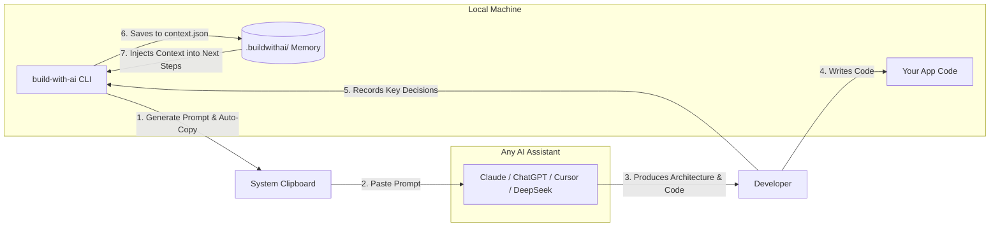

# build-with-ai

> A zero-API, local-first CLI that guides you step-by-step through building complete software projects with any AI — by generating the right prompt at every stage.

<div align="center">

[](https://github.com/PicadoLabs/build-with-ai/actions/workflows/ci.yml)
[](https://www.npmjs.com/package/build-with-ai)
[](LICENSE)
[](https://nodejs.org)
[-8b5cf6.svg)](README.md)
[](CONTRIBUTING.md)

[Quickstart](#quickstart) • [How It Works](#how-it-works) • [Architecture](#architecture) • [User Story Walkthrough](#user-story-riya-builds-a-saas-app) • [Commands](#commands-reference) • [Templates](#available-templates) • [Contributing](CONTRIBUTING.md)

</div>

---

## What Is build-with-ai?

`build-with-ai` is an interactive CLI orchestrator that acts as your **personal software architect**. It breaks software development down into disciplined, sequential engineering phases and generates context-aware, copy-ready prompts for each stage.

You paste the prompt into any AI assistant you already use (Claude, ChatGPT, Cursor, Gemini, DeepSeek, Copilot, or local Ollama models), build that step, and record your decisions. The CLI remembers every architectural choice you make in a local `.buildwithai/` store and automatically injects those decisions into future step prompts.

**Key Guarantee: Zero API keys, zero accounts, zero telemetry, and zero cost.** It never touches or overwrites your application source code.

---

## The Problem It Solves

When developers try to build non-trivial applications with AI assistants, they consistently hit three major roadblocks:

| The Problem | What Happens | How `build-with-ai` Solves It |
| :--- | :--- | :--- |
| **The Blank Canvas** | You ask for a "full app" and get 800 lines of fragmented, unmaintainable code. | Breaks projects into 10-23 sequential phases: Discovery $\rightarrow$ Schema $\rightarrow$ Auth $\rightarrow$ Core CRUD $\rightarrow$ Testing $\rightarrow$ Deploy. |
| **Context Drift** | By step 8, in a new chat, the AI forgets earlier decisions (e.g. database, auth models). | Maintains a local `context.json` memory and automatically injects decisions into downstream prompts (`{{decisions.database}}`). |
| **Skipping Phases** | Developers jump straight to frontend UI before designing schemas, auth, or error contracts. | Step prerequisites (`requires`) ensure architecture is defined before coding begins. |

---

## How It Works



---

## Quickstart

Run directly without installing via `npx`:

```bash
npx build-with-ai
```

Or install globally:

```bash
npm install -g build-with-ai
```

---

## Features

- **Step-by-Step Structured Workflows** — Guides you through Discovery, Architecture, Schema, Scaffolding, Auth, Core CRUD, UI, Testing, Security, Deployment, and Portfolio Documentation.
- **Automatic Context Injection** — Architectural choices made in early steps are automatically embedded into downstream prompts using `{{decisions.key}}` interpolation.
- **Auto-Clipboard Integration** — Every prompt is automatically copied to your clipboard with cross-platform fallback safety.
- **Universal AI Compatibility** — Works with ChatGPT, Claude, Gemini, DeepSeek, Cursor, GitHub Copilot, or local Ollama models.
- **RECOMMENDED AI & TARGET FILES Hints** — Every step banner displays recommended AI models and specific target files to create or edit.
- **Direct Context Modification** — View or update decisions on the fly with `build-with-ai context` and `build-with-ai set <key> <value>`.
- **Arbitrary Step Navigation** — Jump to any step using `build-with-ai jump <stepNumber>` or step back with `build-with-ai back`.
- **Custom Template Loading** — Load community templates from local JSON files or remote HTTPS URLs (`--template <path-or-url>`).
- **Deterministic Documentation Export** — Generates complete `README.md`, `BUILD_LOG.md`, and `CONTEXT.md` documentation when finished.
- **6 Built-in Production Templates** — Full-Stack Web App, REST API, SaaS MVP, Mobile App (Expo), Chrome Extension, and AI Agent & RAG Pipeline.
- **100% Local & Private** — No telemetry, no network calls to proprietary AI APIs, and zero vendor lock-in.

---

## User Story: Riya Builds a SaaS App

Here is what a complete development session looks like for a real developer.

### 1. Project Initialization

```bash
mkdir invoice-tracker && cd invoice-tracker
npx build-with-ai init
```

Riya selects the **Modern SaaS MVP** template (15 steps), sets her experience level to **Intermediate**, and enters her project idea:

```text
Project: Invoice Tracker
Idea:    A subscription SaaS for freelancers to track client invoices and automate payment reminders.
```

The CLI scaffolds `.buildwithai/` (`state.json`, `context.json`, `history/`).

### 2. Generating the First Prompt (`next`)

```bash
npx build-with-ai next
```

The CLI outputs the formatted step and copies the prompt to the clipboard:

```text
 STEP 1/15 — Problem Discovery & SaaS Value Proposition 

PHASE: Discovery
RECOMMENDED AI: Claude 3.5 Sonnet / GPT-4o

WHY THIS STEP: Identify the target customer segment, define the core pain point,
and craft a compelling SaaS value proposition.
WHAT AI SHOULD PRODUCE: Clear customer persona, 2-sentence value proposition, and
3 measurable success metrics.

────────────────────────────────────────────────────────────
PROMPT FOR YOUR AI:
────────────────────────────────────────────────────────────
I am building a SaaS product called "Invoice Tracker".
The core idea is: A subscription SaaS for freelancers to track client invoices...
My experience level is Intermediate.

Act as a SaaS product strategist:
1. Define the primary customer persona (role, company size, key pain point).
2. Write a crisp 2-sentence value proposition...
────────────────────────────────────────────────────────────

Prompt copied to clipboard ✅
```

### 3. Recording Decisions (`done`)

After pasting the prompt into Claude and receiving the response, Riya runs:

```bash
npx build-with-ai done
```

She enters concise summaries for `decisions.targetCustomer` and `decisions.coreValueProp`. The decisions are saved to `context.json`, and the CLI advances to Step 2.

### 4. Automatic Context Injection (Step 3)

When Riya reaches **Step 3: Technology Stack Selection**, the CLI automatically retrieves her previously recorded decisions:

```text
 STEP 3/15 — SaaS Technology Stack Selection 

PHASE: Tech Stack
RECOMMENDED AI: Claude 3.5 Sonnet / GPT-4o
TARGET FILES: package.json

PROMPT FOR YOUR AI:
────────────────────────────────────────────────────────────
My experience level is Intermediate and "Invoice Tracker" needs these features:
[Injected from Step 2: MVP Features]

The target customer is: Freelance designers and consultants.
The core value proposition is: Invoice Tracker helps freelancers send professional
invoices in minutes and get paid 40% faster...

Recommend the optimal SaaS tech stack...
────────────────────────────────────────────────────────────
```

### 5. On-the-Fly Decision Editing (`set`)

Valid JSON values are stored with their types: arrays, objects, numbers, booleans,
and `null`. Ordinary text and invalid JSON remain strings. To store a JSON-looking
value as a string, pass a JSON string literal (including its double quotes).

```bash
npx build-with-ai set decisions.features '["Auth", "Export"]'
npx build-with-ai set decisions.options '{"enabled": true}'
npx build-with-ai set decisions.code '"123"'
```

If Riya decides to change her database from SQLite to PostgreSQL with Prisma:

```bash
npx build-with-ai set decisions.database "PostgreSQL with Prisma ORM"
```

```text
✔ Updated "decisions.database"
  Before: SQLite
  After:  PostgreSQL with Prisma ORM
```

### 6. Checking Progress (`status`)

```bash
npx build-with-ai status
```

```text
PROJECT STATUS: Invoice Tracker
───────────────────────────────────────────────────────
Template:   Modern SaaS MVP
Experience: Intermediate
Progress:   [████████████░░░░░░░░░░░░] 47% (7/15 steps)

WORKFLOW STEPS:
  ✔ 1. Problem Discovery [Discovery]
  ✔ 2. MVP Feature Scoping [Requirements]
  ✔ 3. SaaS Technology Stack [Tech Stack]
  ✔ 4. Supabase Database Schema [Database]
  ✔ 5. Next.js API Routes [API]
  ✔ 6. Supabase Auth Flow [Authentication]
  ➤ 7. Stripe Subscription Integration [Payments] (Current)
  ○ 8. Transactional Emails with Resend [Email]
  ...
```

### 7. Exporting Production Documentation (`export`)

Upon completing the workflow, Riya runs:

```bash
npx build-with-ai export
```

Three deterministic documentation files are generated:
- `README.md` — Complete project overview, architecture breakdown, and setup instructions.
- `BUILD_LOG.md` — Chronological changelog tracking every design decision and saved response.
- `.buildwithai/CONTEXT.md` — Markdown projection of all recorded architectural decisions.

---

### Inspecting Recorded History

List saved step logs with their filenames and last-modified timestamps:

```bash
npx build-with-ai history
```

Read the complete saved Markdown for a particular step:

```bash
npx build-with-ai history 2
```

Run these commands from an initialized project. Only recorded logs are listed;
missing logs and invalid step numbers produce a helpful error.

## Commands Reference

| Command | Description |
| :--- | :--- |
| `npx build-with-ai` | Smart launcher — displays project status or initiates onboarding. |
| `npx build-with-ai init` | Start interactive setup wizard (template, experience, project idea). |
| `npx build-with-ai init --template <path\|url>` | Load a custom template from a local file path or remote HTTPS URL. |
| `npx build-with-ai next` | Generate and clipboard-copy the prompt for the active step. |
| `npx build-with-ai next --no-copy` | Generate the prompt without accessing the clipboard. |
| `npx build-with-ai next --raw` | Print only the raw prompt string (ideal for scripting and CLI pipes). |
| `npx build-with-ai next --json` | Print complete step metadata as structured JSON. |
| `npx build-with-ai done` | Record decisions into `context.json`, archive response, and advance step. |
| `npx build-with-ai back` | Move back to the previous step without deleting recorded history. |
| `npx build-with-ai jump [stepNumber]` | Jump directly to any step number (interactive step picker fallback). |
| `npx build-with-ai context [key]` | Inspect all recorded decisions or look up a specific dot-notation key. |
| `npx build-with-ai set <key> <value>` | Update any decision in `context.json` directly from the terminal. |
| `npx build-with-ai status` | Display visual progress bar, step status checklist, and recorded decisions. |
| `npx build-with-ai resume` | Welcome-back dashboard summarizing current focus and next action. |
| `npx build-with-ai export` | Generate `README.md`, `BUILD_LOG.md`, and `.buildwithai/CONTEXT.md`. |
| `npx build-with-ai list` | List all available built-in templates and their total step counts. |
| `npx build-with-ai reset` | Safely remove `.buildwithai/` state (never touches user code). |

### Searching and Listing Templates

Use `npx build-with-ai list --search api` (or `list -s api`) to search template
IDs, titles, and descriptions without case sensitivity. Use `list --json` for
a JSON array containing `id`, `title`, `description`, and `stepCount`.
The options can be combined: `list -s api --json`. An unmatched search prints
a message in text mode or `[]` in JSON mode. These commands do not require an
initialized project.

### Disabling Clipboard Copy

For headless or SSH sessions, use `next --no-copy`, or set
`BUILD_WITH_AI_NO_COPY=1` in the environment to disable clipboard copying by
default. The prompt is still printed. Other environment values leave copying
enabled unless `--no-copy` is provided. `--raw` and `--json` continue to print
only their requested output, without clipboard hints.

### Using `next --json` in Scripts
 
[#using-next---json-in-scripts](#using-next---json-in-scripts)
 
`npx build-with-ai next --json` prints the current step as structured JSON instead of the formatted terminal banner — handy for piping into other tools, editors, or custom scripts.
 
**JSON fields:**
 
| Field | Description |
| :--- | :--- |
| `step` | Current step number |
| `totalSteps` | Total steps in the active template |
| `title` | Step title |
| `phase` | Phase this step belongs to (e.g. `Discovery`, `Tech Stack`) |
| `goal` | Why this step matters |
| `expectedOutput` | What the AI should produce |
| `recommendedAI` | Suggested AI model(s) for this step |
| `targetFiles` | Files this step is expected to create or edit |
| `warnings` | Any unresolved prerequisites or placeholders |
| `prompt` | The fully resolved prompt text to paste into your AI |
 
**Extract just the prompt — Unix-like shells (bash/zsh), using `jq`:**
 
```bash
npx build-with-ai next --json | jq -r '.prompt'
```
 
**Extract just the prompt — Windows PowerShell:**
 
```powershell
npx build-with-ai next --json | ConvertFrom-Json | Select-Object -ExpandProperty prompt
```
 
**No `jq`? Use Node instead (works the same on Windows, macOS, and Linux):**
 
```bash
npx build-with-ai next --json | node -e "let d='';process.stdin.on('data',c=>d+=c);process.stdin.on('end',()=>console.log(JSON.parse(d).prompt))"
```

---

## Available Templates

| Template ID | Template Title | Steps | Primary Tech Stack |
| :--- | :--- | :---: | :--- |
| `web-app` | **Full-Stack Web Application** | 23 | Next.js / React, Tailwind CSS, Prisma ORM, PostgreSQL |
| `saas-mvp` | **Modern SaaS MVP** | 15 | Next.js 14 App Router, Supabase, Stripe, Resend Email |
| `rest-api` | **Backend REST API Service** | 10 | Node.js, Fastify / Express, PostgreSQL, Zod |
| `mobile-app` | **Cross-Platform Mobile App** | 15 | React Native, Expo Router, NativeWind, EAS Build |
| `flutter-app` | **Flutter Mobile Application** | 16 | Flutter 3.x, Dart, Riverpod / BLoC, Clean Architecture |
| `chrome-extension` | **Chrome Browser Extension** | 12 | Manifest V3, Vite, React, Shadow DOM |
| `ai-agent` | **AI Agent & RAG Pipeline** | 14 | LangChain / LlamaIndex, Vector DB, FastAPI / Express |

---

## Architecture & Storage Design

All metadata and state are stored in a self-contained `.buildwithai/` folder in your project root:

```text
my-project/
├── .buildwithai/
│   ├── state.json        # Progress tracking (currentStep, completedSteps, timestamps)
│   ├── context.json      # Structured decisions store (single source of truth)
│   ├── CONTEXT.md        # Generated markdown view of context.json
│   └── history/          # Archived raw AI responses (step-01.md, step-02.md, ...)
├── src/                  # User application code (never touched by CLI)
├── README.md             # Generated on export
└── BUILD_LOG.md          # Generated on export
```

---

## Contributing

We welcome contributions from the community. Please review [CONTRIBUTING.md](CONTRIBUTING.md) for details on our workflow, coding standards, and pull request process.

Please also read our [Code of Conduct](CODE_OF_CONDUCT.md).

---

## Security

Security is critical to build-with-ai. If you discover a vulnerability, please report it privately by emailing [picadolabs@gmail.com](mailto:picadolabs@gmail.com). For more information, see [SECURITY.md](SECURITY.md).

---

## Community & Maintainers

build-with-ai is maintained by [PicadoLabs](https://picadolabs.me).

- **Maintainer:** https://github.com/Kaap10
- **GitHub Organization:** https://github.com/PicadoLabs
- **Website:** https://picadolabs.me
- **Contact & Inquiries:** [picadolabs@gmail.com](mailto:picadolabs@gmail.com)

---

## License

This project is licensed under the **MIT License** - see the [LICENSE](LICENSE) file for details.

Copyright (c) 2026 PicadoLabs.
