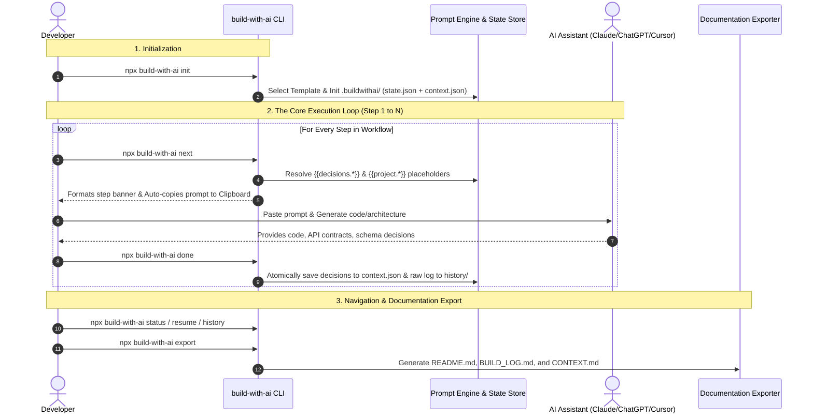

# How `build-with-ai` Works: Complete Architecture & Execution Guide

`build-with-ai` is a **zero-API, local-first interactive CLI orchestrator** designed to guide developers step-by-step through building complex, production-grade software applications using any AI assistant (ChatGPT, Claude, Cursor, Gemini, DeepSeek, or local Ollama models).

This guide explains the complete internal architecture, data flow, state machine, and mechanics of the project.

---

## 1. The Core Philosophy (Why Zero-API?)

Most AI developer tools require API keys, send your entire codebase to external cloud servers, and charge token fees. When you ask an AI to "build an entire SaaS app" in a single prompt, it hallucinates, produces broken monolithic code, and forgets earlier decisions by step 8.

**`build-with-ai` solves this differently:**
- **Zero API Keys & Zero Cost:** You use your existing free or paid AI chat subscriptions (Claude Web, ChatGPT Plus, Cursor, etc.).
- **Context Preservation Without Code Access:** The CLI never reads or modifies your source code. It only tracks architectural decisions in a clean, local `.buildwithai/` folder.
- **Disciplined Sequential Engineering:** Projects are broken into 10 to 23 structured phases (Discovery $\rightarrow$ Tech Stack $\rightarrow$ Schema $\rightarrow$ Auth $\rightarrow$ Core Business Logic $\rightarrow$ Testing $\rightarrow$ Deployment).

---

## 2. High-Level Architecture & Lifecycle Diagram



---

## 3. Internal Storage & State Machine

When you run `build-with-ai init`, a self-contained `.buildwithai/` directory is created in your project root:

```text
my-project/
├── .buildwithai/
│   ├── state.json        # Progress pointer (currentStep, completedSteps, timestamps)
│   ├── context.json      # Single source of truth for architectural decisions
│   └── history/          # Archived raw AI responses (step-01.md, step-02.md, ...)
├── src/                  # YOUR application code (100% untouched by CLI)
├── package.json
└── README.md
```

### Data Structures

#### `state.json` (Progress Tracker)
```json
{
  "projectName": "Invoice Tracker",
  "templateId": "saas-mvp",
  "templateTitle": "Modern SaaS MVP",
  "experienceLevel": "Intermediate",
  "projectIdea": "A subscription SaaS for freelancers to track invoices.",
  "currentStep": 3,
  "totalSteps": 15,
  "completedSteps": [1, 2],
  "startedAt": "2026-09-30T10:00:00.000Z",
  "updatedAt": "2026-09-30T10:15:00.000Z"
}
```

#### `context.json` (Decision Store)
```json
{
  "project": {
    "name": "Invoice Tracker",
    "type": "saas-mvp",
    "experienceLevel": "Intermediate",
    "idea": "A subscription SaaS for freelancers to track invoices."
  },
  "decisions": {
    "targetCustomer": "Freelancers and boutique agencies",
    "coreValueProp": "Send invoices in 60 seconds and automate follow-ups",
    "mvpFeatures": "Invoicing, Stripe payments, Client portal",
    "database": "PostgreSQL with Prisma ORM",
    "authStrategy": "Supabase Auth with JWT"
  }
}
```

#### `history/step-XX.md` (Raw AI Logs)
Raw Markdown text of previous AI responses is saved here so you can review full conversations or recover past outputs at any time using `npx build-with-ai history <stepNumber>`.

---

## 4. Step-by-Step Command Workflow

### Step 1: Project Initialization (`init`)
```bash
npx build-with-ai init
```
- Lets you pick from **10 built-in templates** (Web App, SaaS MVP, FastAPI, Multi-Agent AI, Mobile, Flutter, REST API, Chrome Extension, Discord Bot, AI Agent) or provide your own via `--template <path|url>`.
- Collects project name, experience level, and a 1-line project summary.
- Initializes `.buildwithai/` atomically.

---

### Step 2: Generating the Current Prompt (`next`)
```bash
npx build-with-ai next
```
1. **Reads** `state.json` to find `currentStep`.
2. **Loads** the corresponding step definition from `templates/<templateId>.json`.
3. **Resolves Placeholders:** Replaces `{{project.name}}`, `{{project.idea}}`, and `{{decisions.<key>}}` using values from `context.json`.
4. **Checks Prerequisites (`requires`):** If a previous step's decision is missing, it displays a clear `Warning — Context Gaps:` banner instead of crashing.
5. **Renders Rich Terminal UI:** Shows step goal, expected AI output, recommended AI models, and target files.
6. **Auto-Clipboard:** Copies the interpolated prompt directly to your system clipboard.

---

### Step 3: Completing a Step (`done`)
```bash
npx build-with-ai done
```
After pasting the prompt into ChatGPT/Claude and receiving your architecture or code:
1. **Prompt for Decisions:** Asks for concise summaries of decisions made in this step (e.g. `database = PostgreSQL`, `auth = Clerk`).
2. **Writes Decisions:** Stores decisions cleanly in `context.json` using dot-notation (`setByPath`).
3. **Saves Full Markdown:** Optionally archives the raw AI response into `.buildwithai/history/step-XX.md`.
4. **Advances Pointer:** Increments `currentStep` in `state.json` and adds the completed step to `completedSteps`.

---

### Step 4: Progress, Navigation & Inspection
- **`npx build-with-ai status`**: Displays a progress bar, time elapsed, completed checklist, and recorded decisions.
- **`npx build-with-ai resume`**: Welcome-back dashboard when returning to your project in a new terminal session.
- **`npx build-with-ai back`**: Moves one step backward safely without deleting history or context.
- **`npx build-with-ai jump <step>`**: Jumps directly to any step number (with interactive list picker fallback).
- **`npx build-with-ai context [key]`**: Inspects all recorded decisions or queries a specific dot-notation path.
- **`npx build-with-ai set <key> <value>`**: Directly updates or overrides any decision in `context.json`.
- **`npx build-with-ai history [stepNum]`**: Lists timestamps of recorded history or prints the full markdown of step X.

---

### Step 5: Exporting Production Documentation (`export`)
```bash
npx build-with-ai export
```
Compiles your project's history and decisions into 3 production documents:
1. **`README.md`**: Project overview, tech stack, prerequisites, and setup instructions.
2. **`BUILD_LOG.md`**: Full chronological audit trail of all architectural steps and AI responses.
3. **`.buildwithai/CONTEXT.md`**: Clean markdown summary of all recorded decisions.

Supports flags:
- `--dry-run`: Previews the generated files without writing anything to disk.
- `--out-dir ./docs`: Writes all documentation to a custom target directory.

---

## 5. How Context Interpolation Works (The Engine)

In every template step, prompts are written with variable placeholders:

```text
Prompt Template:
"I am building {{project.name}}. The database is {{decisions.database}}. 
Design the authentication layer using {{decisions.authStrategy}}."
```

When `resolveStepPrompt()` runs:
1. It scans the string with regex `/\{\{\s*([a-zA-Z0-9_.]+)\s*\}\}/g`.
2. For each key, it calls `getByPath(context, keyPath)` (e.g. `context.decisions.database`).
3. If the value exists, it replaces the placeholder with the recorded decision.
4. If the value is missing, it injects `[MISSING: keyPath]` and logs a non-fatal warning so the developer is aware.

---

## 6. Atomic Persistence & Data Safety

To prevent file corruption if the user presses `Ctrl+C` or their computer crashes during a write:
- The CLI uses `writeJsonAtomic(filePath, value)`.
- It writes the JSON to a temporary file (`state.json.<pid>.<random>.tmp`).
- It then executes an atomic OS-level file rename (`fs.renameSync`) to overwrite the target file in a single tick.
- If an error occurs, the temporary file is unlinked, leaving your existing state intact.

---

## 7. Scripting & Automation (`--json` & `--raw`)

Every command supports machine-readable output for integration with scripts, editors, or pipelines:

```bash
# Get raw prompt only (ideal for piping to CLI LLMs like ollama or llm)
npx build-with-ai next --raw | ollama run codellama

# Get structured JSON for tools
npx build-with-ai status --json
npx build-with-ai next --json
```

---

## Summary Matrix

| Feature | How It Works |
|---|---|
| **Zero-API** | Prompts are generated locally and copied to clipboard; you paste into your favorite AI. |
| **Context Memory** | Key decisions are saved in `context.json` and dynamically interpolated into downstream prompts. |
| **Code Safety** | Never scans, touches, or modifies your application source code. |
| **Data Durability** | Atomic filesystem writes guarantee zero corrupted state files. |
| **Universal Extensibility** | Supports 10 built-in templates, custom local files (`--template ./my.json`), and remote URLs. |
